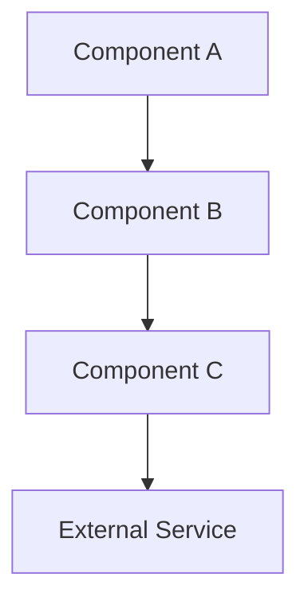
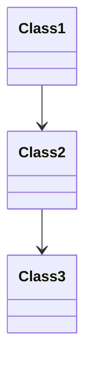
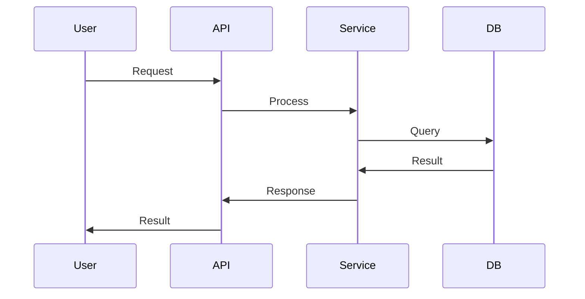

# Progressive Disclosure Depth Templates

## D0 - Hub Document Template

**Requirements**:
- **Length**: 200-400 lines maximum
- **Token Budget**: 500-1000 tokens
- **Scan Time**: 30 seconds to identify components
- **Purpose**: Single entry point for all documentation

**Template Structure**:

```markdown
# [Project] Documentation Hub [D0]

## Quick Orientation (30-second scan)
- **What**: [One-line project description]
- **Why**: [Core problem it solves]
- **How**: [High-level approach in 2-3 sentences]
- **Stack**: [Primary technologies]

## Project Map (1-minute scan)
### Core Components
- **Component-A** [D1-D3] - [Brief description] → `docs/COMPONENT-A.md`
- **Component-B** [D1-D4] - [Brief description] → `docs/COMPONENT-B.md`
- **Component-C** [D1-D2] - [Brief description] → `docs/COMPONENT-C.md`

### Technology Stack
- **Language/Framework**: [Version] → `docs/TECH-STACK.md` [D1-D2]
- **Database**: [Type] → `docs/DATABASE.md` [D1-D3]
- **Infrastructure**: [Platform] → `docs/INFRA.md` [D1-D4]

### Critical File Entry Points
```
project/
├── src/main.ext           # Application entry
├── config/app.conf        # Core configuration
└── scripts/deploy.sh      # Deployment entry
```

## Task-Based Navigation
**Development Tasks**:
- Fix bug in [component] → `docs/[COMPONENT].md` [D1-D2]
- Add feature to [system] → `docs/[SYSTEM].md` [D1-D3]
- Refactor [module] → `docs/ARCHITECTURE.md` [D2-D4]

**Operations Tasks**:
- Deploy to [environment] → `docs/DEPLOYMENT.md` [D1-D2]
- Debug [issue] → `docs/TROUBLESHOOTING.md` [D1-D3]
- Configure [service] → `docs/CONFIGURATION.md` [D1-D2]

## Depth Level Guide
- **[D0]** Hub: You are here (30s, ~800 tokens)
- **[D1]** Overview: What/Why/How (2-5 min, ~1500 tokens)
- **[D2]** Implementation: Patterns & code (5-15 min, ~3500 tokens)
- **[D3]** Architecture: Design & decisions (15-30 min, ~7500 tokens)
- **[D4]** Complete Reference: Full API/specs (30-60 min, ~15000 tokens)
- **[D5]** Historical Context: Evolution & why (as needed, ~7500 tokens)

## Progressive Discovery Paths
### By Role
- **LLM Agents** → `docs/AGENT-QUICK-START.md` [D1]
- **Developers** → `docs/WORKFLOW-GUIDE.md` [D1]
- **Architects** → `docs/ARCHITECTURE.md` [D3]

### By Component
- **[Primary Component]** → `docs/[COMPONENT-GUIDE].md` [D1-D3]
- **[Secondary Component]** → `docs/[COMPONENT-GUIDE].md` [D1-D2]

---
**Stop here if**: You found the component/doc you need
**Continue to D1 if**: You need component overview and patterns
```

**Stop Condition**: Hub provides signposting to D1 docs

---

## D1 - Component Overview Template

**Requirements**:
- **Length**: 300-600 lines maximum
- **Token Budget**: 1000-2000 tokens
- **Read Time**: 2-5 minutes
- **Purpose**: What/Why/How + Quick Reference + Common Operations

**Template Structure**:

```markdown
# [Component] Guide [D1]

## Purpose (30s)
[Essential overview for LLM agents and developers]

## What (30s)
- This is a [type] component
- Core functionality: [brief description]
- Key capabilities: [list 3-5 main features]

## Why (30s)
- Problem solved: [brief explanation]
- Approach: [high-level strategy]
- Benefits: [key advantages]

## How (1 min)
### Entry Points by Task
- **Fix bug**: Start at [path] → Use [pattern]
- **Add feature**: Start at [path] → Follow [workflow]
- **Integrate**: Use [interface] → See [example]

### Repository Structure
```
component/
├── core/           # [Description] [D2: docs/COMPONENT-IMPL.md]
├── services/       # [Description] [D2: docs/COMPONENT-IMPL.md]
├── interfaces/     # [Description] [D2: docs/COMPONENT-IMPL.md]
└── tests/          # [Description]
```

## Quick Reference (1 min)
### Key Files
- `src/component/main.ext` - [Purpose]
- `src/component/service.ext` - [Purpose]
- `config/component.conf` - [Configuration]

### Dependencies
- [Framework]: v[X.Y]
- [Library]: v[X.Y]
- External: [API/Service]

### Integration Points
- [Component A] ↔ [Component B]: [Interface description]
- [Component B] ↔ External: [API description]

## Common Operations (1 min)

### Operation 1: [Task Name]
```[language]
// Quick example with inline comments
[code example showing typical usage]
```

### Operation 2: [Task Name]
```[language]
// Quick example
[code example]
```

### Operation 3: [Task Name]
```[language]
// Quick example
[code example]
```

## Testing (30s)
```[language]
// Basic test example
[test code showing how to test component]
```

---
**Stop here if**: You have enough context for simple bug fixes or minor features
**Continue to D2 if**: You need implementation patterns and detailed code examples
**Jump to D3 if**: You need architectural understanding for complex refactoring
```

**Stop Condition**: D1 sufficient for minor bug fixes and simple features

---

## D2 - Implementation Guide Template

**Requirements**:
- **Length**: 600-1500 lines
- **Token Budget**: 2000-5000 tokens
- **Read Time**: 5-15 minutes
- **Purpose**: Detailed patterns, code examples, integration, scenarios

**Template Structure**:

```markdown
# [Component] Implementation Guide [D2]

## Purpose (30s)
Detailed implementation patterns for [component]

## Core Patterns (3 min)

### Pattern 1: [Common Use Case]
**When to use**: [scenario description]

```[language]
// Complete working example
[full code example with comments]
```

**Gotchas**:
- [Warning/consideration 1]
- [Warning/consideration 2]

**Alternatives**:
- [Alternative approach and when to use it]

### Pattern 2: [Another Use Case]
**When to use**: [scenario description]

```[language]
// Complete working example
[full code example]
```

### Pattern 3: [Advanced Use Case]
**When to use**: [scenario description]

```[language]
// Complete working example
[full code example]
```

## Code Organization (2 min)

### File Structure
```
component/
├── index.ts           # Exports public API
├── service.ts         # Core business logic
├── repository.ts      # Data access layer
├── types.ts           # Type definitions
└── utils/
    ├── validator.ts   # Input validation
    └── mapper.ts      # Data transformation
```

### Module Boundaries
- **Public API**: [What's exported from index]
- **Internal**: [What stays private]
- **Dependencies**: [What this component depends on]

## Integration Patterns (3 min)

### Integrating with [Component B]
```[language]
// Integration code example
[complete integration example]
```

**Integration Points**:
- [Interface/contract description]
- [Data flow description]

### External API Integration
```[language]
// External API integration
[API client code example]
```

**Configuration**:
```[language]
// Configuration example
[config code]
```

## Common Scenarios (5 min)

### Scenario 1: [Specific Task]
**Goal**: [What you're trying to achieve]

**Step-by-step**:
1. [Step 1 with code]
   ```[language]
   [code]
   ```

2. [Step 2 with code]
   ```[language]
   [code]
   ```

3. [Verification]
   ```[language]
   [verification code]
   ```

### Scenario 2: [Another Task]
[Same structure as Scenario 1]

### Scenario 3: [Advanced Task]
[Same structure]

## Testing Patterns (2 min)

### Unit Tests
```[language]
// Unit test example
[test code]
```

### Integration Tests
```[language]
// Integration test example
[test code]
```

### Mocking Dependencies
```[language]
// Mock setup
[mock code]
```

## Error Handling (2 min)

### Error Types
```[language]
// Custom error definitions
[error type definitions]
```

### Error Handling Pattern
```[language]
// Error handling example
[error handling code]
```

### Common Errors
- **Error 1**: [Description] → [Solution]
- **Error 2**: [Description] → [Solution]
- **Error 3**: [Description] → [Solution]

## Configuration (1 min)

### Configuration Options
```[language]
// Configuration structure
[config interface/schema]
```

### Environment Variables
- `VAR_NAME`: [Description] (default: [value])
- `VAR_NAME_2`: [Description] (required)

### Configuration Example
```[language]
// Complete configuration example
[config code]
```

## Troubleshooting (2 min)

### Issue 1: [Problem Description]
**Symptoms**: [What you see]
**Cause**: [Why it happens]
**Fix**: [How to resolve]
```[language]
// Fix code if applicable
[code]
```

### Issue 2: [Problem Description]
[Same structure]

### Issue 3: [Problem Description]
[Same structure]

---
**Stop here if**: You have implementation patterns for your feature/fix
**Continue to D3 if**: You need architectural context or design decisions
**Jump to D4 if**: You need complete API reference or specifications
```

**Stop Condition**: D2 sufficient for most development tasks

---

## D3 - Architecture Guide Template

**Requirements**:
- **Length**: 1500-3000 lines
- **Token Budget**: 5000-10000 tokens
- **Read Time**: 15-30 minutes
- **Purpose**: System design, decisions, relationships, patterns

**Template Structure**:

```markdown
# [System/Component] Architecture Guide [D3]

## Purpose (1 min)
Architectural overview and design decisions for [system]

## System Design (5 min)

### High-Level Architecture


### Component Relationships
- **Component A**: [Role and responsibilities]
  - Depends on: [List dependencies]
  - Used by: [List consumers]
  - Interfaces: [List public interfaces]

- **Component B**: [Role and responsibilities]
  [Same structure]

### System Boundaries
```
Internal System:
├── Component A (Core)
├── Component B (Services)
└── Component C (Data)

External Dependencies:
├── Database
├── Cache Service
└── External APIs
```

## Design Decisions (10 min)

### Decision 1: [Architectural Choice]
**Context**: [What situation required a decision]

**Decision**: [What was chosen]

**Rationale**: [Why this approach was selected]

**Alternatives Considered**:
- [Alternative 1]: [Why rejected]
- [Alternative 2]: [Why rejected]

**Consequences**:
- **Pros**: [Benefits gained]
- **Cons**: [Trade-offs accepted]
- **Risks**: [Potential issues]

### Decision 2: [Another Choice]
[Same structure as Decision 1]

### Decision 3: [Another Choice]
[Same structure]

## Design Patterns (8 min)

### Pattern 1: [Pattern Name]
**Problem**: [What issue it solves]

**Solution**: [How it's implemented]

**Structure**:


**Example**:
```[language]
// Pattern implementation
[code example]
```

**When to use**: [Scenarios where this pattern applies]

### Pattern 2: [Another Pattern]
[Same structure]

## Data Flow (5 min)

### Request Flow


### Data Transformations
```
Input → [Validation] → [Business Logic] → [Persistence] → [Response]
```

### State Management
[Description of how state is managed across system]

## Component Interactions (5 min)

### Interaction 1: [Flow Name]
**Trigger**: [What initiates this flow]

**Steps**:
1. [Component A] → [Action]
2. [Component B] → [Action]
3. [Component C] → [Action]

**Result**: [Outcome]

### Interaction 2: [Another Flow]
[Same structure]

## Scalability & Performance (3 min)

### Performance Characteristics
- **Throughput**: [Requests per second]
- **Latency**: [Response time metrics]
- **Resource Usage**: [CPU/Memory profiles]

### Bottlenecks
1. [Bottleneck 1]: [Description and impact]
2. [Bottleneck 2]: [Description and impact]

### Optimization Strategies
- [Strategy 1]: [Description and expected gain]
- [Strategy 2]: [Description and expected gain]

### Scaling Considerations
- **Horizontal Scaling**: [How to scale out]
- **Vertical Scaling**: [How to scale up]
- **Limits**: [Known scaling limits]

## Security Architecture (3 min)

### Security Boundaries
```
Public Layer (untrusted)
    ↓ [Authentication]
API Layer (authenticated)
    ↓ [Authorization]
Service Layer (trusted)
    ↓ [Validation]
Data Layer (secured)
```

### Security Patterns
- **Authentication**: [How users/systems are authenticated]
- **Authorization**: [How permissions are enforced]
- **Data Protection**: [How sensitive data is protected]

### Threat Model
- [Threat 1]: [Mitigation strategy]
- [Threat 2]: [Mitigation strategy]

## Deployment Architecture (2 min)

### Deployment Model
```
[Environment diagram showing deployment structure]
```

### Infrastructure
- **Compute**: [Description]
- **Storage**: [Description]
- **Network**: [Description]

---
**Stop here if**: You understand the architecture for your refactoring/feature
**Continue to D4 if**: You need complete API specifications or reference material
**Jump to D5 if**: You need historical context about system evolution
```

**Stop Condition**: D3 sufficient for complex features and refactoring

---

## D4 - Complete Reference Template

**Requirements**:
- **Length**: 3000-6000 lines
- **Token Budget**: 10000-20000 tokens
- **Read Time**: 30-60 minutes
- **Purpose**: Exhaustive API specs, configuration, error codes, edge cases

**Template Structure**:

```markdown
# [Component] Complete Reference [D4]

## Purpose (1 min)
Exhaustive reference for all [component] capabilities

## Complete API Reference (40 min)

### Function/Method 1: [Name]
**Signature**:
```[language]
function methodName(param1: Type1, param2: Type2): ReturnType
```

**Description**: [Detailed description of what this does]

**Parameters**:
- `param1` (Type1): [Description, validation rules, constraints]
- `param2` (Type2): [Description, default value, optional/required]

**Returns**:
- Type: ReturnType
- Description: [What is returned and under what conditions]

**Throws**:
- `ErrorType1`: [When and why this error is thrown]
- `ErrorType2`: [When and why this error is thrown]

**Examples**:
```[language]
// Example 1: Basic usage
[code]

// Example 2: With options
[code]

// Example 3: Error handling
[code]
```

**Edge Cases**:
- [Edge case 1 and behavior]
- [Edge case 2 and behavior]
- [Edge case 3 and behavior]

**Performance**:
- Time complexity: O([X])
- Space complexity: O([X])
- Benchmarks: [Performance data]

**See Also**: [Related functions/methods]

---

[Repeat this structure for ALL functions/methods]

## Configuration Reference (10 min)

### Configuration Option 1: [Name]
**Type**: [Type]
**Default**: [Default value]
**Required**: [Yes/No]

**Description**: [Detailed description]

**Valid Values**: [Enumeration or range]

**Validation Rules**:
- [Rule 1]
- [Rule 2]

**Example**:
```[language]
[configuration example]
```

**Impact**: [How this affects system behavior]

---

[Repeat for all configuration options]

## Error Reference (5 min)

### Error Code 1: [CODE_NAME]
**HTTP Status**: [Status code if applicable]
**Message**: "[Error message text]"

**Cause**: [Why this error occurs]

**Resolution**: [How to fix]

**Example**:
```[language]
// Code that triggers error
[code]

// How to handle
[error handling code]
```

---

[Repeat for all error codes]

## Type Reference (3 min)

### Type/Interface 1: [Name]
```[language]
interface TypeName {
  field1: Type1;  // [Description]
  field2: Type2;  // [Description]
  field3?: Type3; // [Optional, description]
}
```

**Description**: [Purpose of this type]

**Used by**: [List of functions/methods using this type]

**Examples**:
```[language]
// Example usage
[code]
```

---

[Repeat for all types]

## Performance Characteristics (2 min)

### Operation Performance
| Operation | Time Complexity | Space Complexity | Notes |
|-----------|----------------|------------------|-------|
| [Operation 1] | O(1) | O(1) | [Notes] |
| [Operation 2] | O(n) | O(1) | [Notes] |
| [Operation 3] | O(log n) | O(n) | [Notes] |

### Benchmarks
```
Operation 1: 1000 req/s (p50: 10ms, p99: 50ms)
Operation 2: 500 req/s (p50: 20ms, p99: 100ms)
```

### Optimization Notes
- [Optimization tip 1]
- [Optimization tip 2]

---
**Stop here if**: You have the complete reference needed
**Continue to D5 if**: You need to understand historical evolution and decisions
```

**Stop Condition**: D4 provides complete technical reference

---

## D5 - Historical Context Template

**Requirements**:
- **Length**: 1500-3000 lines
- **Token Budget**: 5000-10000 tokens
- **Read Time**: As needed
- **Purpose**: Evolution, migrations, legacy decisions, technical debt

**Template Structure**:

```markdown
# [System/Component] Evolution & History [D5]

## Purpose (1 min)
Historical context for understanding current state and future direction

## Evolution Timeline (10 min)

### Version 1.0 (Date Range)
**Initial Implementation**

**Key Decisions**:
- [Decision 1]: [Rationale]
- [Decision 2]: [Rationale]

**Architecture**: [High-level description]

**Limitations**: [Known issues at this stage]

---

### Version 2.0 (Date Range)
**Major Refactor: [Theme]**

**What Changed**:
- [Change 1]: [From → To]
- [Change 2]: [From → To]

**Why**:
- [Reason for refactor]
- [Problems solved]

**Migration**: [How to upgrade from v1]

**Impact**: [Breaking changes, improvements]

---

### Version 3.0 (Date Range)
**Current Architecture**

**Evolution Rationale**: [Why we arrived here]

**Key Improvements**: [What got better]

**Remaining Debt**: [What still needs work]

---

## Migration Guides (15 min)

### v1 → v2 Migration
**Breaking Changes**:
1. [Change 1]
   - Old: [How it was]
   - New: [How it is]
   - Migration: [Step-by-step]

2. [Change 2]
   [Same structure]

**Migration Steps**:
```bash
# Step-by-step migration commands/code
[migration code]
```

**Verification**:
```bash
# How to verify migration succeeded
[verification code]
```

---

### v2 → v3 Migration
[Same structure as above]

---

## Legacy Decisions (10 min)

### Decision 1: [Original Decision]
**When**: [Date/Version]

**Context**: [Why this decision was made at the time]

**Decision**: [What was chosen]

**Current Impact**:
- **Still Valid**: [Aspects that remain good]
- **Technical Debt**: [Aspects that cause problems now]
- **Would Do Differently**: [What we'd choose today]

**Recommendations**: [How to address/live with this]

---

### Decision 2: [Another Decision]
[Same structure]

---

## Technical Debt (10 min)

### Debt Item 1: [Description]
**Type**: [Architectural/Code/Documentation/etc.]

**Severity**: [High/Medium/Low]

**Impact**:
- [Impact on development]
- [Impact on performance]
- [Impact on maintainability]

**Cause**: [Why this debt exists]

**Cost of Living With It**: [Ongoing impact]

**Cost of Fixing**: [Estimated effort to resolve]

**Plan**: [If/when/how to address]

---

### Debt Item 2: [Description]
[Same structure]

---

## Abandoned Approaches (5 min)

### Approach 1: [Name]
**Tried**: [Date/Version]

**Goal**: [What we hoped to achieve]

**What Happened**: [Why it was abandoned]

**Lessons Learned**:
- [Lesson 1]
- [Lesson 2]

**Recommendations**: [Advice for future]

---

### Approach 2: [Name]
[Same structure]

---

## Lessons Learned (5 min)

### What Worked Well
1. [Success 1]: [Why it worked]
2. [Success 2]: [Why it worked]
3. [Success 3]: [Why it worked]

### What Didn't Work
1. [Failure 1]: [Why it failed, what to avoid]
2. [Failure 2]: [Why it failed, what to avoid]

### Future Considerations
- [Consideration 1]: [Future direction]
- [Consideration 2]: [Improvement opportunity]
- [Consideration 3]: [Strategic decision needed]

---

## Future Roadmap (5 min)

### Planned Improvements
- **Short-term** (Next 3-6 months):
  - [Improvement 1]
  - [Improvement 2]

- **Medium-term** (6-12 months):
  - [Improvement 1]
  - [Improvement 2]

- **Long-term** (12+ months):
  - [Strategic change 1]
  - [Strategic change 2]

### Known Blockers
- [Blocker 1]: [Description and plan]
- [Blocker 2]: [Description and plan]

---
**Stop here**: You have complete historical context
```

**Stop Condition**: Complete historical understanding achieved
