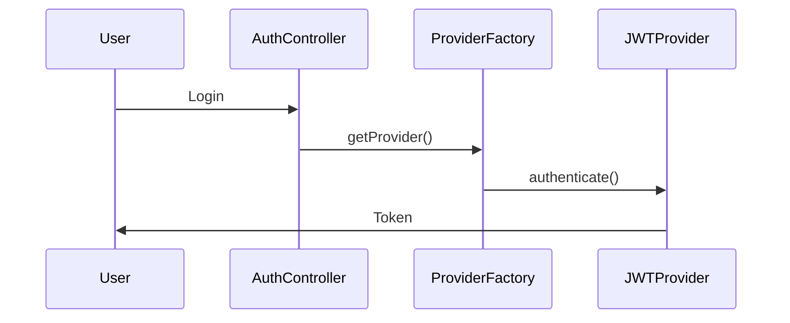

# Documentation PD Navigator - Detailed Navigation Flows

## Example Navigation Flow 1: Simple Bug Fix

**Task**: "Fix null pointer exception in user login"

**Complete Navigation**:

### Step 1: Hub Scan (30 seconds, ~800 tokens)
```
Read: DOCUMENTATION-HUB.md [D0]

Extract:
- Component-A (Authentication) → AUTH-GUIDE.md [D1-D3]
- Entry point reference: src/auth/
- Task mapping: "Fix bug" → Component guide [D1-D2]

Decision: Navigate to AUTH-GUIDE.md [D1]
```

### Step 2: Component Overview (3 minutes, ~1,500 tokens)
```
Read: AUTH-GUIDE.md [D1]

Extract:
## What (30s)
- JWT-based authentication system
- Handles login, logout, token validation

## Quick Reference (1 min)
- Entry Point: src/auth/JWTService.ts
- Dependencies: jsonwebtoken, bcrypt
- Interfaces: AuthService, TokenValidator

## Common Operations (1 min)
### Login Flow
1. Validate credentials
2. Generate JWT token
3. Return token to client

Stop Condition Evaluation:
✓ "Stop here if: basic integration or minor fix"
✓ I have entry point: src/auth/JWTService.ts
✓ Task is minor bug fix: YES

Decision: STOP at D1
```

**Total Cost**: 3.5 minutes, ~2,300 tokens

**Result**: Have entry point and enough context to fix bug

**What NOT to do**:
- ✗ Don't read AUTH-IMPL.md [D2] - not needed for simple bug
- ✗ Don't read AUTH-ARCH.md [D3] - overkill for bug fix
- ✗ Don't continue deeper "just to be sure"

---

## Example Navigation Flow 2: Medium Complexity Feature

**Task**: "Add OAuth2 support to authentication system"

**Complete Navigation**:

### Step 1: Hub Scan (30 seconds, ~800 tokens)
```
Read: DOCUMENTATION-HUB.md [D0]

Extract:
- Component-A (Authentication) → AUTH-GUIDE.md [D1-D3]
- Task mapping: "Add feature" → Implementation guide [D2-D3]

Decision: Navigate to AUTH-GUIDE.md [D1] first
```

### Step 2: Component Overview (3 minutes, ~1,500 tokens)
```
Read: AUTH-GUIDE.md [D1]

Extract:
## How (1 min)
- Current implementation: JWT-only
- Provider pattern mentioned but not detailed

Stop Condition Evaluation:
✗ "Stop here if: basic integration or minor fix"
✗ OAuth2 is not basic integration
✗ Need implementation patterns for provider system

Decision: Continue to D2
Reference: AUTH-IMPL.md [D2] for implementation patterns
```

### Step 3: Implementation Guide (8 minutes, ~4,000 tokens)
```
Read: AUTH-IMPL.md [D2]

Extract:
## Implementation Patterns (3 min)
### Pattern: Authentication Provider
```typescript
interface AuthProvider {
  authenticate(credentials: any): Promise<Token>;
  validate(token: string): Promise<boolean>;
}

class JWTProvider implements AuthProvider {
  // Current implementation
}
```

### Pattern: Provider Registration
```typescript
// config/auth.ts
providers: {
  'jwt': JWTProvider,
  // Can add more providers
}
```

## Integration Patterns (3 min)
### Adding New Provider
1. Implement AuthProvider interface
2. Register in config/auth.ts
3. Update login endpoint to accept provider type

## Common Scenarios (2 min)
### Scenario: Add Custom Provider
Step-by-step with code examples

Stop Condition Evaluation:
✓ "Stop here if: implementing standard patterns"
✓ I have provider pattern
✓ I have registration pattern
✓ I have integration steps
✓ OAuth2 fits this standard pattern

Decision: STOP at D2
```

**Total Cost**: 11.5 minutes, ~6,300 tokens

**Result**: Have all patterns needed to implement OAuth2 provider

**What NOT to do**:
- ✗ Don't read AUTH-ARCH.md [D3] - provider pattern sufficient
- ✗ Don't read D4 complete reference - don't need all APIs
- ✗ Architecture not needed for standard feature addition

---

## Example Navigation Flow 3: Architectural Refactoring

**Task**: "Refactor authentication to support multiple simultaneous providers"

**Complete Navigation**:

### Step 1: Hub Scan (30 seconds, ~800 tokens)
```
Read: DOCUMENTATION-HUB.md [D0]

Extract:
- Component-A (Authentication) → AUTH-GUIDE.md [D1-D3]
- Task mapping: "Refactor" → Architecture guide [D2-D4]

Decision: Navigate through full depth progression
```

### Step 2: Component Overview (3 minutes, ~1,500 tokens)
```
Read: AUTH-GUIDE.md [D1]

Extract:
## Current Design
- Single active provider per session
- Provider chosen at application startup

Stop Condition Evaluation:
✗ "Stop here if: basic integration or minor fix"
✗ Major refactoring - need architectural context

Decision: Continue to D2
```

### Step 3: Implementation Guide (8 minutes, ~4,000 tokens)
```
Read: AUTH-IMPL.md [D2]

Extract:
## Current Implementation
- Singleton provider instance
- Configured at bootstrap
- All auth flows use single provider

## Dependencies
- Session manager couples to provider
- Token validator specific to provider type

Stop Condition Evaluation:
✗ "Stop here if: implementing standard patterns"
✗ Need to understand design decisions
✗ Why single provider? What are alternatives?
✗ System-wide impact of multi-provider support

Decision: Continue to D3
Reference: AUTH-ARCH.md [D3] for architecture
```

### Step 4: Architecture Guide (15 minutes, ~7,000 tokens - SELECTIVE)
```
Read: AUTH-ARCH.md [D3] - SELECTIVELY

Read These Sections:
## Design Decisions (10 min)
### Decision: Single Provider Architecture
**Context**: Simple authentication needs at v1.0
**Decision**: One active provider per deployment
**Rationale**:
  - Reduced complexity
  - Clear authentication flow
  - Sufficient for initial requirements
**Alternatives Considered**:
  - Multi-provider: Rejected as too complex for v1
  - Provider chaining: Future consideration
**Consequences**:
  - Limitation: Cannot mix auth methods
  - Trade-off: Simplicity vs. flexibility

## Data Flow (5 min)


Skip These Sections:
## Performance Characteristics
  - Not relevant to refactoring
## Historical Context
  - Can read D5 if needed later

Stop Condition Evaluation:
✓ "Stop here if: architectural context sufficient"
✓ Understand why single provider
✓ Understand current data flow
✓ Know design trade-offs
✓ Ready to design multi-provider solution

Decision: STOP at D3
```

**Total Cost**: 26.5 minutes, ~13,300 tokens

**Result**: Full architectural understanding for major refactoring

**Selective Reading Strategy**:
- ✓ Read design decisions relevant to refactoring
- ✓ Read data flow diagrams
- ✗ Skip performance section (not relevant)
- ✗ Skip historical context (can read D5 later if needed)

---

## Example Navigation Flow 4: API Integration Task

**Task**: "Integrate with external payment service API"

**Complete Navigation**:

### Step 1: Hub Scan (30 seconds, ~800 tokens)
```
Read: DOCUMENTATION-HUB.md [D0]

Extract:
- Component-B (Payment Integration) → PAYMENT-GUIDE.md [D1-D3]
- Component-C (External APIs) → API-INTEGRATION-GUIDE.md [D1-D2]

Decision: Read both, starting with Payment
```

### Step 2: Payment Component (3 minutes, ~1,500 tokens)
```
Read: PAYMENT-GUIDE.md [D1]

Extract:
## What
- Payment processing layer
- Supports multiple payment providers

## Integration Points
- Provider interface: PaymentProvider
- Webhook handler: PaymentWebhookController

Stop Condition:
✗ Need integration patterns - Continue to D2
```

### Step 3: Payment Implementation (5 minutes, ~2,500 tokens)
```
Read: PAYMENT-IMPL.md [D2] - SELECTIVELY

Read These Sections:
## Integration Patterns (3 min)
### Pattern: External Payment Provider
```typescript
interface PaymentProvider {
  processPayment(data: PaymentRequest): Promise<PaymentResult>;
  handleWebhook(payload: any): Promise<void>;
}

class StripeProvider implements PaymentProvider {
  // Example implementation
}
```

## Common Scenarios (2 min)
### Scenario: Add New Provider
1. Implement PaymentProvider interface
2. Handle provider-specific webhooks
3. Map provider responses to internal format

Stop Condition:
✓ Have provider pattern
✓ Have webhook handling pattern

Decision: STOP at D2 for Payment component
```

### Step 4: API Integration Guide (3 minutes, ~1,500 tokens)
```
Read: API-INTEGRATION-GUIDE.md [D1]

Extract:
## Best Practices
- Use HTTP client abstraction
- Implement retry logic
- Handle rate limiting
- Secure API key storage

Stop Condition:
✓ Have integration best practices
✓ Have patterns for external APIs

Decision: STOP at D1 for API component
```

**Total Cost**: 11.5 minutes, ~6,300 tokens across 2 components

**Result**: Have patterns for both payment integration and external API handling

---

## Decision Tree for Depth Navigation

```
Start at D0 (Hub)
    ↓
Located relevant component?
    Yes → Continue to D1
    No → Re-scan hub or search
    ↓
Read D1 (Component Overview)
    ↓
Task is simple integration or minor fix?
    Yes → STOP at D1
    No → Continue to D2
    ↓
Read D2 (Implementation)
    ↓
Have implementation patterns needed?
    Yes → STOP at D2
    No → Need architecture?
        Yes → Continue to D3
        No → Re-evaluate task
    ↓
Read D3 (Architecture) - SELECTIVELY
    ↓
Understand design decisions?
    Yes → STOP at D3
    No → Need complete reference?
        Yes → Continue to D4
        No → Re-evaluate information needs
    ↓
Read D4 (Complete Reference) - AS NEEDED
    ↓
Have complete technical reference?
    Yes → STOP at D4
    No → Need historical context?
        Yes → Continue to D5
        No → Information may not exist
    ↓
Read D5 (Historical Context) - RARE
```

## Task-Specific Navigation Patterns

### Bug Fix Pattern

**Simple Bug** (D0-D1):
- Hub → Component → Entry point → STOP
- Token budget: 1,500-3,000
- Time: 3-5 minutes

**Complex Bug** (D0-D2):
- Hub → Component → Implementation patterns → STOP
- Token budget: 3,500-7,000
- Time: 8-15 minutes

### Feature Addition Pattern

**Simple Feature** (D0-D1 or D0-D2):
- Hub → Component → Patterns (if needed) → STOP
- Token budget: 3,500-7,000
- Time: 8-15 minutes

**Complex Feature** (D0-D3):
- Hub → Component → Implementation → Architecture → STOP
- Token budget: 8,000-15,000
- Time: 15-30 minutes

### Refactoring Pattern

**Component Refactoring** (D0-D2):
- Hub → Component → Implementation patterns → STOP
- Token budget: 3,500-7,000
- Time: 8-15 minutes

**Architectural Refactoring** (D0-D3):
- Hub → Component → Implementation → Architecture → STOP
- Token budget: 8,000-15,000
- Time: 15-30 minutes

### Integration Pattern

**Simple Integration** (D0-D1):
- Hub → Components → Interfaces → STOP
- Token budget: 3,000-5,000
- Time: 5-10 minutes

**Complex Integration** (D0-D2):
- Hub → Multiple components → Implementation patterns → STOP
- Token budget: 5,000-10,000
- Time: 10-20 minutes

## Multi-Component Navigation

**When task spans multiple components**:

1. Read hub once (D0)
2. Navigate to first component (D1+)
3. Stop at appropriate depth for first component
4. Navigate to second component (D1+)
5. Stop at appropriate depth for second component
6. Continue until all relevant components covered

**Example**:
```
Task: "Integrate payment processing with user authentication"

Navigation:
1. D0: Hub scan → Locate Auth and Payment components
2. D1: AUTH-GUIDE.md → Stop (have auth interface)
3. D1: PAYMENT-GUIDE.md → Continue to D2
4. D2: PAYMENT-IMPL.md → Stop (have payment patterns)

Total: D0 + D1 (Auth) + D2 (Payment)
Token budget: 800 + 1,500 + 4,000 = 6,300 tokens
```

## Progressive Reading Strategy

### At Each Depth Level

**Read in this order**:
1. Purpose/What section (30 seconds)
2. Quick Reference (1-2 minutes)
3. Relevant workflow sections (2-5 minutes)
4. Stop condition evaluation
5. Decision: Stop or continue

**Skip**:
- Sections not relevant to current task
- Optional examples if patterns are clear
- Historical context unless specifically needed

### Selective Reading Markers

Look for these signals to skip content:

**"Optional" sections**: Read only if unclear
**"Advanced" sections**: Read only if doing advanced work
**"Historical" sections**: Read only if context needed
**"Complete reference"**: Read only specific items needed

### Example of Selective Reading

```
## Implementation Patterns

### Pattern 1: Standard Use Case (READ THIS)
...

### Pattern 2: Edge Case Handling (SKIP if not relevant)
...

### Pattern 3: Advanced Optimization (SKIP for basic implementation)
...

## Complete API Reference (READ SELECTIVELY)
- Method A: authenticate() (READ if using)
- Method B: validateToken() (READ if using)
- Method C: revokeToken() (SKIP if not revoking)
...
```
